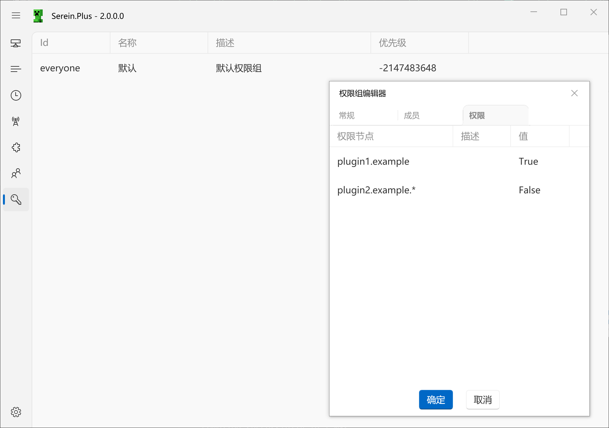

# 权限组



灵感来源于Java版的权限组插件（如[LuckPerms](https://luckperms.net/)、[GroupManager](https://www.spigotmc.org/resources/groupmanager.38875/)），旨在快捷设定用户在插件功能中的权限

## 权限节点

权限节点是用于标识特定权限的字符串

```regex title="校验正则"
^([a-zA-Z][a-zA-Z0-9\-]*\.)*[a-zA-Z][a-zA-Z0-9\-]*$
```

你在权限组编辑器中可以使用通配符，代表该节点下和所有后代节点

例如，现在已由插件注册了`plugin1.admin.start-server`和`plugin1.admin.stop-server`，则你可以使用`plugin1.admin.*`同时指代以上两个节点

## 优先级

优先级越高的权限组中的权限节点 会覆盖 优先级低的权限组的权限节点

## 父权限组

父权限组中规定的权限节点也会被包括进输出结果中
