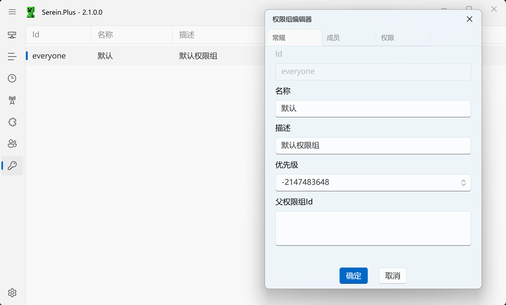

# 权限组



## 什么是权限组？

权限组是 Serein 内置的权限管理系统，灵感来源于 Java 版的权限组插件（如 [LuckPerms](https://luckperms.net/)、[GroupManager](https://www.spigotmc.org/resources/groupmanager.38875/)），帮助你精确控制不同用户在插件功能中的权限。

## 权限节点

权限节点是用于标识特定权限的字符串，采用层次化的命名规则。

### 命名规则

权限节点必须符合以下格式：

```regex title="校验正则"
^([a-zA-Z][a-zA-Z0-9\-]*\.)*[a-zA-Z][a-zA-Z0-9\-]*$
```

**格式说明**：

- 以字母开头
- 可包含字母、数字、连字符（`-`）
- 使用点号（`.`）分隔层级
- 不能以点号开头或结尾

### 权限节点示例

```text
✅ 正确格式
plugin.admin.restart-server
serein.command.execute
mybot.message.send

❌ 错误格式
.plugin.admin          // 不能以点号开头
plugin..admin          // 不能有连续点号
plugin.admin.          // 不能以点号结尾
123plugin.admin        // 不能以数字开头
```

### 通配符支持

你在权限组编辑器中可以使用通配符（`.*`），代表该节点下的所有子节点。

**示例**：假设插件注册了以下权限节点：

- `plugin1.admin.start-server`
- `plugin1.admin.stop-server`
- `plugin1.admin.restart-server`
- `plugin1.user.view-status`

使用通配符：

- `plugin1.admin.*` → 包含所有 admin 相关权限
- `plugin1.*` → 包含该插件的所有权限

### 权限值类型

权限节点可以设置三种值：

| 值      | 含义   | 说明                           |
| ------- | ------ | ------------------------------ |
| `True`  | 允许   | 用户拥有此权限                 |
| `False` | 拒绝   | 明确拒绝此权限                 |
| `Null`  | 未设置 | 不影响权限判断，由其他规则决定 |

## 权限组配置

### 基本属性

每个权限组包含以下属性：

| 属性         | 说明                                                | 必填  |
| ------------ | --------------------------------------------------- | :---: |
| **ID**       | 权限组的唯一标识符，必须为至少3个字符的字母数字组合 |   ✅   |
| **名称**     | 权限组的显示名称                                    |   ❌   |
| **描述**     | 权限组的详细说明                                    |   ❌   |
| **优先级**   | 数字，越高优先级越高（默认为 0）                    |   ❌   |
| **成员**     | 属于该权限组的用户 ID 列表                          |   ❌   |
| **父权限组** | 继承权限的上级权限组                                |   ❌   |
| **权限节点** | 具体的权限设置                                      |   ❌   |

### 特殊权限组

- **`everyone`**：系统内置的默认权限组，所有用户自动属于此组，无法删除

## 机制

### 优先级

优先级决定了权限冲突时的处理方式：

1. 数值越大，优先级越高
2. 高优先级的权限设置会覆盖低优先级的设置

### 父权限组继承

父权限组的权限会被子权限组继承，实现权限的层次化管理。

1. 子权限组会继承父权限组的所有权限设置
2. 子权限组的设置优先于父权限组
3. 支持多重继承（一个权限组可以有多个父权限组）
