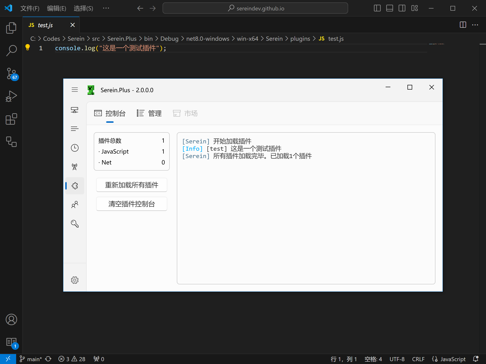

# 插件

Serein 的插件系统是其最强大的特色功能，让你能够通过自定义插件实现几乎任何你能想到的功能扩展



## 插件能做什么？

### 数据分析

- **玩家统计** - 在线时长、活跃度分析
- **服务器报告** - 自动生成运营报告
- **实时监控** - 性能指标可视化

### 外部集成

- **数据库连接** - MySQL、PostgreSQL、MongoDB 等
- **API 对接** - 第三方服务集成、Web 服务调用
- **文件处理** - 自动备份、日志分析、文件管理

## 插件市场

详见 [Serein 社区插件市场](https://sereincommunity.github.io/plugins)

这里有丰富的现成插件等你发现！

## 插件类型

### JavaScript

- **👍 优点**
  - 开发速度快
  - 语法简单，易于编写
  - 提供较详细的[文档](../development/plugins/js/)和类型库
- **👎 缺点**
  - 通常体量较小，不适于大型插件开发
  - 运行速度较慢

### .NET

:::warning

此功能还处于实验性阶段，目前可能存在插件对象无法**完全释放**等问题

:::

- **👍 优点**
  - 运行速度较快
  - 可以使用[NuGet](https://www.nuget.org/)包
- **👎 缺点**
  - 开发周期长
  - 可能需要自行阅读源码

## 插件开发实例

### 简单的欢迎插件

```javascript title="welcome.js"
// 新玩家加入欢迎
serein.setListener('ServerOutput', async (server, line) => {
    const joinMatch = line.match(/(\w+) joined the game/);
    if (joinMatch) {
        const playerName = joinMatch[1];
        server.sendCommand(`say 欢迎 ${playerName} 加入服务器！`);
        
        // 发送到 QQ 群
        await serein.connection.sendMessageAsync(
            TargetType.Group
            '123456789', 
            `🎉 新玩家 ${playerName} 加入了服务器！`
        );
    }
});
```

### 自动备份系统

```javascript title="auto-backup.js"
// 每四小时备份一次
setInterval(performBackup, 60 * 60 * 4);

function performBackup() {
    const backupDir = 'backups';
    const timestamp = new Date().toISOString().slice(0, 10);
    
    // 停止服务器
    serein.servers['bds'].stop();
    
    // 执行备份逻辑
    // ...
    
    console.log(`备份完成: backup-${timestamp}.zip`);
    
    // 重启服务器
    serein.servers['bds'].start();
}
```
