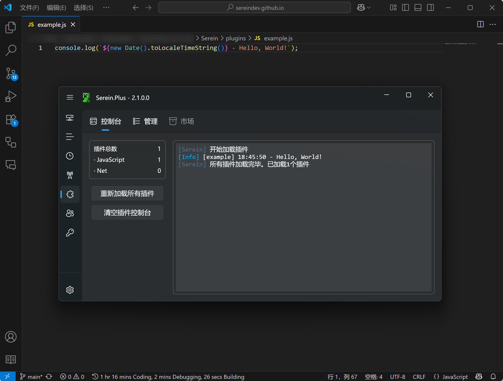

# 插件

Serein的一大特色，允许用户使用自定义的插件扩展功能

## 插件市场

详见[社区](https://sereincommunity.github.io/plugins)

## 插件类型

### JavaScript

- **👍 优点**
  - 开发速度快
  - 语法简单，易于编写
  - 提供较详细的[文档](../development/plugins/js/)和类型库
- **👎 缺点**
  - 通常体量较小，不适于大型插件开发
  - 运行速度较慢

### NET

:::warning

此功能还处于实验性阶段，目前存在插件对象无法释放等问题

:::

- **👍 优点**
  - 运行速度较快
  - 可以使用[Nuget](https://www.nuget.org/)包
- **👎 缺点**
  - 开发周期长
  - 没有文档，需要自行阅读源码
