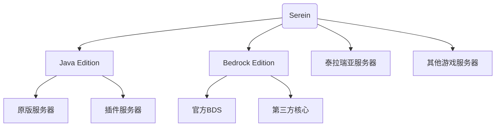

# 服务器管理

> **一个 Serein，管理全世界** - 体验前所未有的多服务器统一管理

Serein v2 革命性地引入了多服务器管理功能，让您告别繁琐的多窗口操作，用一个界面轻松掌控您的整个服务器


## 优势

### 统一控制

- **一站式管理** - 生存服、创造服、小游戏服统一管理，再也不用来回切换
- **实时监控** - 所有服务器的状态、性能、玩家数量一目了然
- **批量操作** - 公告发送、备份任务、维护操作可以批量执行

### 灵活的服务器类型支持



## 服务器配置详解

### 服务器标识 (Server ID)

每个服务器都需要一个唯一的标识符：

```regex title="格式规则"
^\w{3,}$
```

### 其他配置

:::info 相关阅读

- [添加服务器](../tutorial/rookie/add_server)
- [编辑或删除服务器配置](../tutorial/rookie/edit_server)
- [使用虚拟终端](../tutorial/advanced/pty)

:::
