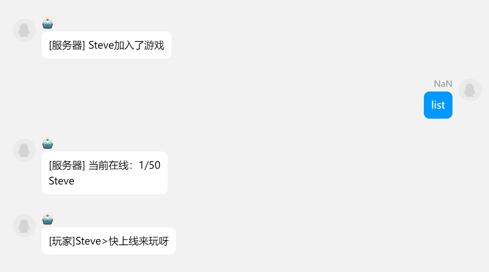

# 介绍

![Serein](https://socialify.git.ci/SereinDev/Serein/image?font=KoHo&forks=1&issues=1&language=1&logo=data%3Aimage%2Fpng%3Bbase64%2CiVBORw0KGgoAAAANSUhEUgAAAgAAAAIABAMAAAAGVsnJAAAABGdBTUEAALGPC%2FxhBQAAACBjSFJNAAB6JgAAgIQAAPoAAACA6AAAdTAAAOpgAAA6mAAAF3CculE8AAAAJFBMVEUAAABLzDoklCEAAAA8tSxCxTEYTREHNQMIPQMBIwACLgH%2F%2F%2F9EIbNrAAAAAXRSTlMAQObYZgAAAAFiS0dECx%2FXxMAAAAAHdElNRQfoBAUCJBr7k6kPAAACqElEQVR42u3cQRXCMBBF0ViohVqIBSxgAQtYqAUsoJJNt5yZHqalhPvWk8W%2FAtJasunLzRtr1QEAAAAAAAAAAAAAAAAAAAAAAAAAAAAAAAAAAAAAAAAAAAAAAAAAAAAAAAAAAAAAAAAAAAAAAAAAAAAAAAAAAAAAAAAAAAADAvSgaNDW9wAAAAAAAAAAAAAAAAAAAAAAAAAAAAAAAAAAAAAAAAAAAAAAAAAAAAAAAAAAAAAAAAAAAAAAAAAAAAAAAAAAAAAAAAAAAACAeoDqgcP9IAEAAAAAAAAAAAAAAAAAAAAAAAAAAAAAAAAAAAAAAAAAAAAMCNA%2FDAAAAAAAAAAAAAAAAAAAAAAAAAAAAAAAAAAAAAAAAAAAAAAAAAAAAAAAAAAAAAAAAAAAAAAAAAAAAAAAAAAAAAAAAAAAAABwPoDqewAAAAAAAAAAAAAAAAAAAAAAAAAAAAAAAAAAAAAAAAAAAADA%2FgBR88G1swUAAAAAAAAAAAAAAAAAAAD8IcClOAAAAAAAAAAAAAAAAAAAAAAAAAAAAAAAAAAAAAAAAAAAAAAAAAAAAAAAAAAAAAAAAAAAAAAAAAAAAAAAAAAAAAAAAAAAAAAAAAAAAAAAAAAAAAAAAAAAAAAAAAAAAAAAAAAAAAAAAAAAAAAAAAAAAAAAAAAAAAAAAAAAAABA3DXZlCwaeAs6HAgAAAAAAAAAAAAAAAAAAAAAAAAAAAAAAAAAAAAAAAAAAAAAAAAAAAAAAAAAAAAAAAAAAAAAAAAAAAAAAAAAAAAAAAAAAAAAAAAAAAAAAAAAAAAAAAAAAAAAAAAAAAAAAAAAAAAAAAAAAAD4AYB7siXZY%2B3dgB70XAMAAAAAAAAAAAAAAAAAAAAAAAAAAAAAAAAAAAAAAAAAAAAAhL0AiB0RKxum4ykAAAAldEVYdGRhdGU6Y3JlYXRlADIwMjQtMDQtMDVUMDI6MzY6MjQrMDA6MDCBxqVlAAAAJXRFWHRkYXRlOm1vZGlmeQAyMDI0LTA0LTA1VDAyOjM2OjI0KzAwOjAw8Jsd2QAAAABJRU5ErkJggg%3D%3D&name=1&owner=1&pattern=Circuit%20Board&pulls=1&stargazers=1#light)

![Serein](https://socialify.git.ci/SereinDev/Serein/image?font=KoHo&forks=1&issues=1&language=1&logo=data%3Aimage%2Fpng%3Bbase64%2CiVBORw0KGgoAAAANSUhEUgAAAgAAAAIABAMAAAAGVsnJAAAABGdBTUEAALGPC%2FxhBQAAACBjSFJNAAB6JgAAgIQAAPoAAACA6AAAdTAAAOpgAAA6mAAAF3CculE8AAAAJFBMVEUAAABLzDoklCEAAAA8tSxCxTEYTREHNQMIPQMBIwACLgH%2F%2F%2F9EIbNrAAAAAXRSTlMAQObYZgAAAAFiS0dECx%2FXxMAAAAAHdElNRQfoBAUCJBr7k6kPAAACqElEQVR42u3cQRXCMBBF0ViohVqIBSxgAQtYqAUsoJJNt5yZHqalhPvWk8W%2FAtJasunLzRtr1QEAAAAAAAAAAAAAAAAAAAAAAAAAAAAAAAAAAAAAAAAAAAAAAAAAAAAAAAAAAAAAAAAAAAAAAAAAAAAAAAAAAAAAAAAAAAADAvSgaNDW9wAAAAAAAAAAAAAAAAAAAAAAAAAAAAAAAAAAAAAAAAAAAAAAAAAAAAAAAAAAAAAAAAAAAAAAAAAAAAAAAAAAAAAAAAAAAACAeoDqgcP9IAEAAAAAAAAAAAAAAAAAAAAAAAAAAAAAAAAAAAAAAAAAAAAMCNA%2FDAAAAAAAAAAAAAAAAAAAAAAAAAAAAAAAAAAAAAAAAAAAAAAAAAAAAAAAAAAAAAAAAAAAAAAAAAAAAAAAAAAAAAAAAAAAAABwPoDqewAAAAAAAAAAAAAAAAAAAAAAAAAAAAAAAAAAAAAAAAAAAADA%2FgBR88G1swUAAAAAAAAAAAAAAAAAAAD8IcClOAAAAAAAAAAAAAAAAAAAAAAAAAAAAAAAAAAAAAAAAAAAAAAAAAAAAAAAAAAAAAAAAAAAAAAAAAAAAAAAAAAAAAAAAAAAAAAAAAAAAAAAAAAAAAAAAAAAAAAAAAAAAAAAAAAAAAAAAAAAAAAAAAAAAAAAAAAAAAAAAAAAAABA3DXZlCwaeAs6HAgAAAAAAAAAAAAAAAAAAAAAAAAAAAAAAAAAAAAAAAAAAAAAAAAAAAAAAAAAAAAAAAAAAAAAAAAAAAAAAAAAAAAAAAAAAAAAAAAAAAAAAAAAAAAAAAAAAAAAAAAAAAAAAAAAAAAAAAAAAAD4AYB7siXZY%2B3dgB70XAMAAAAAAAAAAAAAAAAAAAAAAAAAAAAAAAAAAAAAAAAAAAAAhL0AiB0RKxum4ykAAAAldEVYdGRhdGU6Y3JlYXRlADIwMjQtMDQtMDVUMDI6MzY6MjQrMDA6MDCBxqVlAAAAJXRFWHRkYXRlOm1vZGlmeQAyMDI0LTA0LTA1VDAyOjM2OjI0KzAwOjAw8Jsd2QAAAABJRU5ErkJggg%3D%3D&name=1&owner=1&pattern=Circuit%20Board&pulls=1&stargazers=1&theme=Dark#dark)

**Serein**，一款专为游戏服务器设计的自动化管理工具，支持多服务器统一管理、群服互通、网页远程控制、插件扩展等功能

---

:::tip

- 第一次见面打算上手试试？👉[快速上手](./tutorial/rookie/get_started)
- 曾经使用过旧版本并打算更新到v2.x？👉[迁移教程](./tutorial/migration/from_v1)

:::

## 为什么选择 Serein？

💡 **3 分钟上手** - 简洁的界面设计，无需复杂配置即可开始使用

⚡ **全自动化** - 一次配置，永久生效，告别重复操作

🌐 **跨平台连接** - 无缝连接 QQ、Discord 等社交平台，随时随地管理服务器

🔧 **零代码扩展** - 丰富的插件生态，满足个性化需求

🛠 **开源透明** 所有源代码都在 [GitHub](https://github.com/SereinDev) 上开源，告别后门漏洞

⌚ **长期维护** 此项目会一直保持更新维护状态，坚决不咕~~🕊🕊🕊~~

## 核心功能一览

### 📊 多服务器管理

- **统一管理** - 一个界面管理多个服务器，支持 Java 版、基岩版、泰拉瑞亚服等
- **性能监控** - 实时查看 CPU占用和在线玩家数据

### 🤖 智能自动化

- **智能响应** - 基于正则表达式的事件触发，实现群服消息互通、自动回复等
- **定时任务** - 自动重启、定时公告、定期备份，服务器 7×24 小时稳定运行

### 🌍 社群连接桥梁

- **多平台支持** - 支持多种协议连接 QQ、Discord 等主流社交平台
- **实时管理** - 手机上就能查看服务器状态、管理玩家、执行指令

### 🛜 网页控制台远程管理

- **现代化界面** - 简洁美观的网页设计，支持明暗主题切换，自适应屏幕大小调整布局
- **远程访问** - 随时随地通过浏览器访问服务器控制台，无需安装额外软件

### 🧩 无限扩展可能

- **双语言插件** - 支持 JavaScript 和 .NET 插件开发
- **丰富 API** - 完整的[接口文档](./development/)，轻松实现自定义功能
- **内置权限组** 高仿 Java 服的权限组功能，用户可以快速修改群成员的权限

---

出于篇幅限制，Serein 的功能当然并不只限于此。

我们期待你能自行探索 Serein 的更多丰富功能，创造出更精彩的故事和辉煌。

还在等什么呢？快 [上手试试](./tutorial/rookie/get_started) 吧:D
