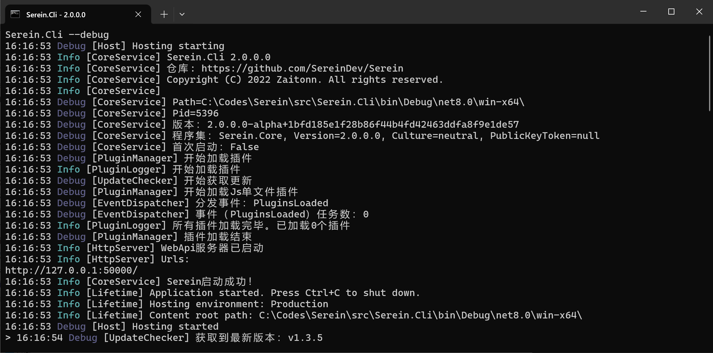

# 启动参数

## 日志模式

```sh
./Serein.Cli --log
./Serein.Lite --log
./Serein.Plus --log
```

开启后将所有输出（包括调试输出）保存到`Serein/logs/app`下，通常用于向开发者反馈问题

:::warning
**你不应该在日常使用时开启此选项**

日志文件可能很大很大很大，并对硬盘的读写速度产生一定影响
:::

<details>

<summary>
示例输出
</summary>

```log
16:21:12.951615 [Microsoft.Extensions.Hosting.Internal.Host] [Debug/Starting] Hosting starting
16:21:12.990879 [Serein.Core.Services.CoreService] [Information/0] Serein.Lite 2.0.0.0
16:21:12.993196 [Serein.Core.Services.CoreService] [Information/0] 仓库: https://github.com/SereinDev/Serein
16:21:12.993217 [Serein.Core.Services.CoreService] [Information/0] Copyright (C) 2022 Zaitonn. All rights reserved.
16:21:12.993221 [Serein.Core.Services.CoreService] [Information/0] 
16:21:12.993267 [Serein.Core.Services.CoreService] [Debug/0] Path=C:\Codes\Serein\src\Serein.Lite\bin\Debug\net8.0-windows\win-x64\publish\
16:21:12.993288 [Serein.Core.Services.CoreService] [Debug/0] Pid=24456
16:21:12.993322 [Serein.Core.Services.CoreService] [Debug/0] 版本：2.0.0.0-alpha+c165706bf61db4c691d7f66fab2a526a3698fbc8
16:21:12.993347 [Serein.Core.Services.CoreService] [Debug/0] 程序集：Serein.Core, Version=2.0.0.0, Culture=neutral, PublicKeyToken=null
16:21:12.993461 [Serein.Core.Services.CoreService] [Debug/0] 首次启动：False
16:21:13.003900 [Serein.Core.Services.Network.UpdateChecker] [Debug/0] 开始获取更新
16:21:13.004381 [Serein.Core.Services.Plugins.PluginManager] [Debug/0] 插件加载结束
16:21:13.058166 [Serein.Core.Services.CoreService] [Information/0] Serein启动成功！
16:21:13.058725 [Microsoft.Hosting.Lifetime] [Information/0] Application started. Press Ctrl+C to shut down.
16:21:13.058854 [Microsoft.Hosting.Lifetime] [Information/0] Hosting environment: Production
16:21:13.058877 [Microsoft.Hosting.Lifetime] [Information/0] Content root path: C:\Codes\Serein\src\Serein.Lite\bin\Debug\net8.0-windows\win-x64\publish\
16:21:13.059136 [Microsoft.Extensions.Hosting.Internal.Host] [Debug/Started] Hosting started
16:21:14.218953 [Serein.Core.Services.Network.UpdateChecker] [Debug/0] 获取到最新版本：v1.3.5
16:21:14.219357 [Serein.Core.Services.Network.UpdateChecker] [Debug/0] 获取更新结束
```

</details>

## 去除输出颜色

:::note
仅对于[Serein.Cli](../rookie/choose#cli)有效
:::

```sh
./Serein.Cli --no-color
```

开启后将会禁用输入自动补全功能，并去除所有颜色代码（但是服务器输出的颜色代码不受影响）

## 调试模式

:::note
仅对于[Serein.Cli](../rookie/choose#cli)有效
:::

```sh
./Serein.Cli --debug
```

开启后将会在控制台输出调试信息


