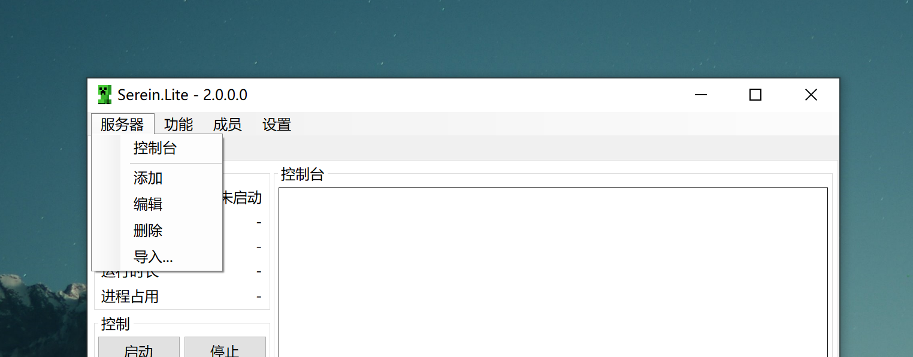
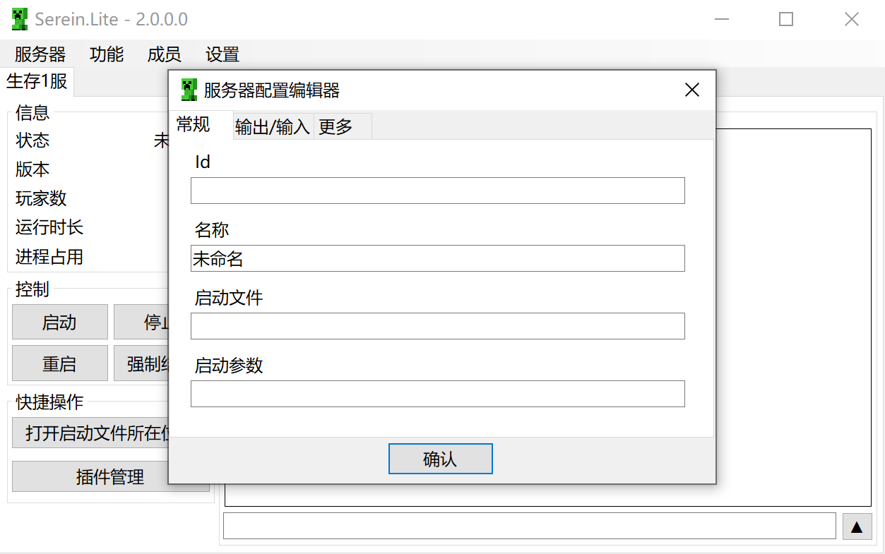
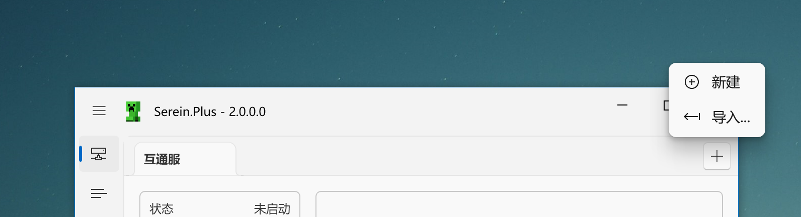
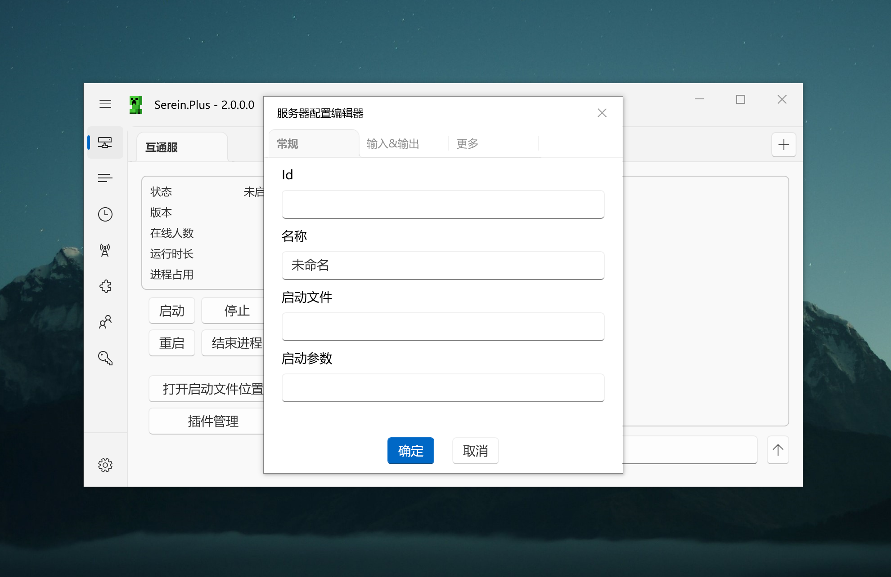

# 添加服务器配置

<Tabs groupId="type">

<TabItem value="lite" label="Serein.Lite" >

点击上方的服务器菜单栏

在配置编辑器中填写相应项

:::tip

你可以双击 启动文件 的文本框打开文件选择窗口

:::

</TabItem>
<TabItem value="plus" label="Serein.Plus">

点击服务器页右上角的加号

- **新建** 从头创建一个新的配置
- **导入** 导入服务器配置（`*.json`）

在配置编辑器中填写相应项

:::tip

你可以双击 启动文件 的文本框打开文件选择窗口

:::

</TabItem>

<TabItem value="cli" label="Serein.Cli" >

暂无直接添加的方法，但是你可以选择以下方法间接添加

- 手写服务器配置文件 **（不推荐）**
- 使用Serein.Lite/Serein.Plus创建后复制到`Serein/servers/`文件夹下

</TabItem>

</Tabs>

## 如何选择启动文件

- **Java**
  1. 在服务器根目录下创建一个批处理文件（`*.bat`）
  2. 在里面写你的启动命令（如`java -jar server.jar`）
  3. 保存
  4. 选择此文件
- **基岩版**  
  直接选择`bedrock_server.exe`或`bedrock_server_mod.exe`
- **其他**  
  选择软件本体或启动软件用的批处理文件
