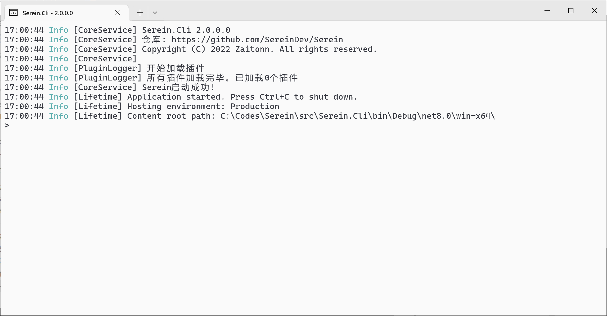
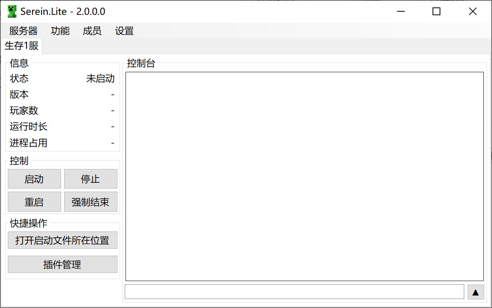

# 选择类型

## 一览

|              |    [Serein.Cli](#cli)     |                 [Serein.Lite](#lite)                 |                [Serein.Plus](#plus)                |
| :----------: | :-----------------------: | :--------------------------------------------------: | :------------------------------------------------: |
|    UI 界面    | **无**  只有命令行窗口 | **有**    使用 WinForm 实现 较简洁但可能不易上手 | **有**   使用 WPF 实现，界面精美 适于新手使用✨ |
| 内存占用[^1] |       最小（<20MB）       |                    中等（<100MB）                    |                   较大（<500MB）                   |
|   推荐配置   |        内存>500MB         |                       内存>1GB                       |                      内存>2GB                      |
|  支持的系统  | Windows Linux macOS |                       Windows                        |                      Windows                       |
| 多服务器管理 |           ✔[^2]           |                          ✔                           |                         ✔                          |
|     匹配     |           ✔[^3]           |                          ✔                           |                         ✔                          |
|   定时任务   |           ✔[^3]           |                          ✔                           |                         ✔                          |
|  群成员管理  |           ✔[^3]           |                          ✔                           |                         ✔                          |
|  机器人连接  |             ✔             |                          ✔                           |                         ✔                          |
|     插件     |             ✔             |                          ✔                           |                         ✔                          |
|     设置     |           ✔[^3]           |                          ✔                           |                         ✔                          |

:::note

- 三者的大部分功能没有差异，且配置文件通用
  - 你可以将他们放在同目录下并使用`Serein Plus`/`Serein Lite`修改`Serein Cli`的配置文件
- 三种类型和[1.x 时的三种版本](/docs/1.x/tutorial/differenceBetweenVersions)分别对应
  - `Cli` 👉 `Console`
  - `Lite` 👉 `Winform`
  - `Plus` 👉 `WPF`

:::

## Cli

使用命令行操作，适用于群组服或较低配置的服务器

## Lite

极简且经典的 UI，上手可能需要较长时间

## Plus

较精美的 UI

[^1]: 理论估计，实际上可能因插件等原因存在差异

[^2]: 理论支持，但可能较难使用，因此建议仅开启单个服务器或使用网页版控制台[即将到来]

[^3]: 没有修改界面，但是可以通过编辑文件实现修改
