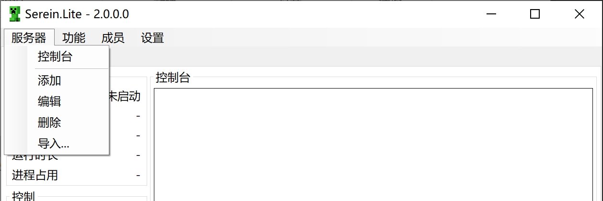
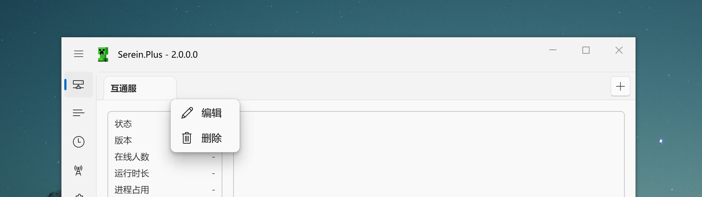

# 编辑或删除服务器

<Tabs groupId="type">

<TabItem value="lite" label="Serein.Lite" >

点击上方的服务器菜单栏

</TabItem>
<TabItem value="plus" label="Serein.Plus">

右键点击服务器页上方选项卡

</TabItem>

<TabItem value="cli" label="Serein.Cli" >

暂无直接修改的方法，但是你可以选择以下方法间接添加

- 手写服务器配置文件 **（不推荐）**
- 使用Serein.Lite/Serein.Plus创建后复制到`Serein/servers/`文件夹下

</TabItem>

</Tabs>

:::note
你无法删除正在运行的服务器
:::
