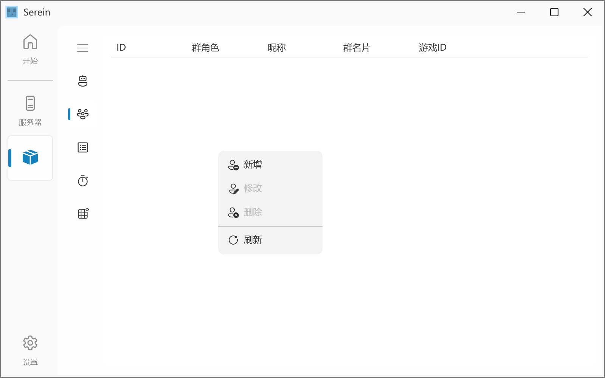

# 成员管理

管理 QQ 号与游戏 ID 的绑定关系



任务数据保存在 data/menbers.json

## 食用方法

- 通过触发命令[bind/unbind](command#绑定游戏id)进行操作
  - 游戏 ID 校验默认正则`^[a-zA-Z0-9_\s-]{3,16}$`
    - 长度为 4-16
    - 仅含有大小写英文字符、下划线、空格
    - 你可以在`settings/Serein.json`内[修改](./hiddenSettings#regexforcheckinggameid)
- 通过[JavaScript 插件](../development/functions/binder)执行`serein.bindMember()`或`serein.unbindMember()`增删绑定记录
- 在列表中右键可编辑绑定的游戏 ID 或删除所选记录

## 文件格式

```json title='data/members.json'
{
  "type": "MEMBERS",
  "comment": "非必要请不要直接修改文件，语法错误可能导致数据丢失",
  "data": [
    {
      "id": 10001, // QQ号
      "card": "群名片",
      "nickname": "昵称",
      "role": 1, // 群角色类型，0=群主，1=管理员，2=普通群员
      "gameID": "Li_Tiansuo" // 游戏ID
    }
  ]
}
```
