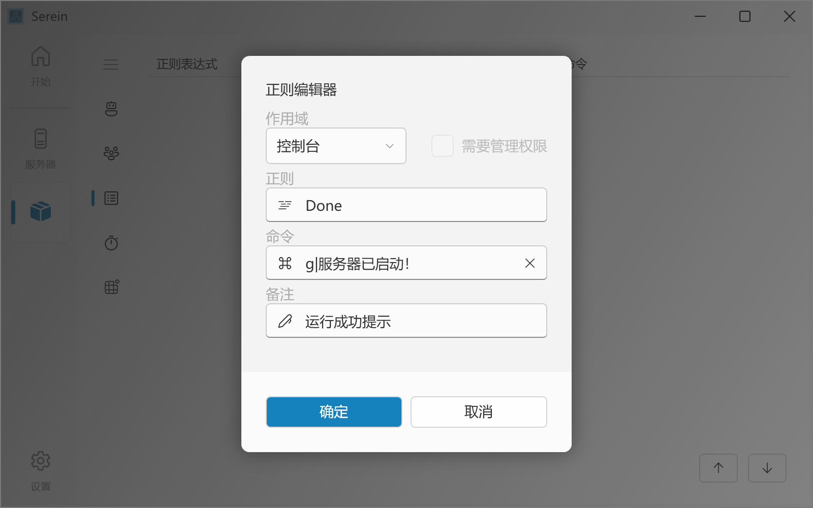

# 正则

匹配处理控制台或机器人消息，执行特定的[命令](command)



正则数据保存在 data/regex.json

## 食用方法

在正则表格中右键打开菜单，在弹出的对话框中输入相应文本修改或创建正则记录
  
:::caution
正则表达式或命令为空或不合法时无法保存
:::

## 功能介绍

### 作用域

指定匹配的区域，可为以下五个值

- 禁用 *不做任何匹配*
- 控制台 *匹配控制台*
- 消息（群聊） *匹配群聊消息*
- 消息（私聊） *匹配私聊消息*
- 消息（自身发送） *匹配自身上报消息*

:::caution
若选择**消息（自身发送）**，保存前请务必检查这条正则触发的命令是否会导致再次被所触发内容触发，配置错误可能导致机器人刷屏甚至被封号
:::

### 正则表达式

一种字符串匹配的模式，可以用来检查一个串是否含有某种子串、将匹配的子串替换或者从某个串中取出符合某个条件的子串等。

:::tip
**基础语法**  
[正则表达式 | 菜鸟教程](https://www.runoob.com/regexp/regexp-tutorial.html)  
[.NET 正则表达式 | Microsoft Docs](https://learn.microsoft.com/zh-cn/dotnet/standard/base-types/regular-expressions)

**生成辅助**  
[AI 驱动的正则表达式求解器 | regex.ai](https://regex.ai/)  
[正则可视化 | ihateregex.io](https://ihateregex.io/playground)  
[fast-regexp | @adams549659584](https://adams549659584.github.io/fast-regexp/)  

**教程**  
[自定义正则 | @azhunotfound](../tutorial/customRegex)
:::

| 高级功能                                                                                                                                                                                      | 可用性     |
| --------------------------------------------------------------------------------------------------------------------------------------------------------------------------------------------- | ---------- |
| [替换已编号的组](https://learn.microsoft.com/zh-cn/dotnet/standard/base-types/substitutions-in-regular-expressions#substituting-a-numbered-group) （`$1` `$114514`）                          | 可用       |
| [条件匹配的表达式](https://learn.microsoft.com/zh-cn/dotnet/standard/base-types/alternation-constructs-in-regular-expressions#conditional-matching-with-an-expression)                        | 理论可用   |
| [基于有效的捕获组的条件匹配](https://learn.microsoft.com/zh-cn/dotnet/standard/base-types/alternation-constructs-in-regular-expressions#conditional-matching-based-on-a-valid-captured-group) | 理论可用   |
| [替换命名组](https://learn.microsoft.com/zh-cn/dotnet/standard/base-types/substitutions-in-regular-expressions#substituting-a-named-group)                                                    | 仅NET6.0   |
| [替换整个匹配项](https://learn.microsoft.com/zh-cn/dotnet/standard/base-types/substitutions-in-regular-expressions#substituting-the-entire-match)                                             | *暂不可用* |
| [替换匹配项前的文本](https://learn.microsoft.com/zh-cn/dotnet/standard/base-types/substitutions-in-regular-expressions#substituting-the-entire-match)                                         | *暂不可用* |
| [替换匹配项后的文本](https://learn.microsoft.com/zh-cn/dotnet/standard/base-types/substitutions-in-regular-expressions#substituting-the-text-after-the-match)                                 | *暂不可用* |
| [替换最后捕获的组](https://learn.microsoft.com/zh-cn/dotnet/standard/base-types/substitutions-in-regular-expressions#substituting-the-last-captured-group)                                    | *暂不可用* |
| [替换整个输入字符串](https://learn.microsoft.com/zh-cn/dotnet/standard/base-types/substitutions-in-regular-expressions#substituting-the-entire-input-string)                                  | *暂不可用* |

### 需要管理权限

主要针对群聊消息和私聊消息，触发时会检验用户是否拥有管理权限

### 执行命令

执行一条[Serein命令](command)，你可以在其中插入[变量](variables)

### 备注

对这项内容的备注或注释，不影响匹配

## 文件格式

```json title="data/regex.json"
{
  "type": "REGEX",
  "comment": "非必要请不要直接修改文件，语法错误可能导致数据丢失",
  "data": [
    {
      "expression": "^(.+?)$",  // 正则表达式
      "remark": "",  // 备注
      "command": "",  // 执行命令
      "area": 0,  // 作用域
      "isAdmin": false,  // 需要管理权限
      "ignore": [] // 排除的对象（当作用域为群聊时此处为群号，私聊时为用户ID）
    }
  ]
}
```
