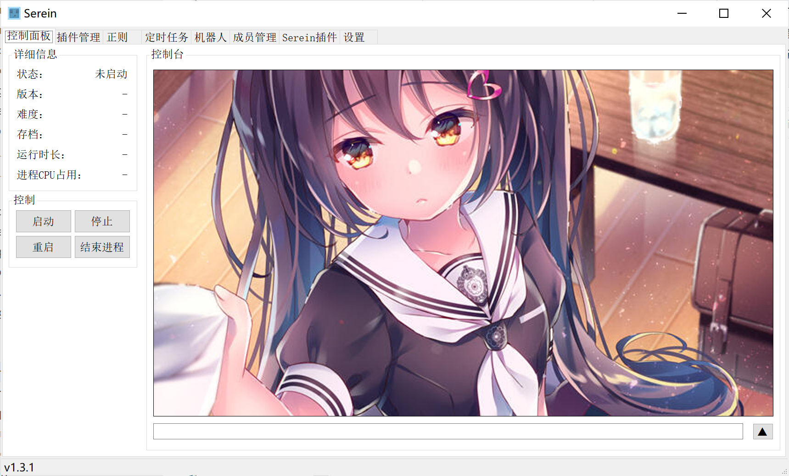
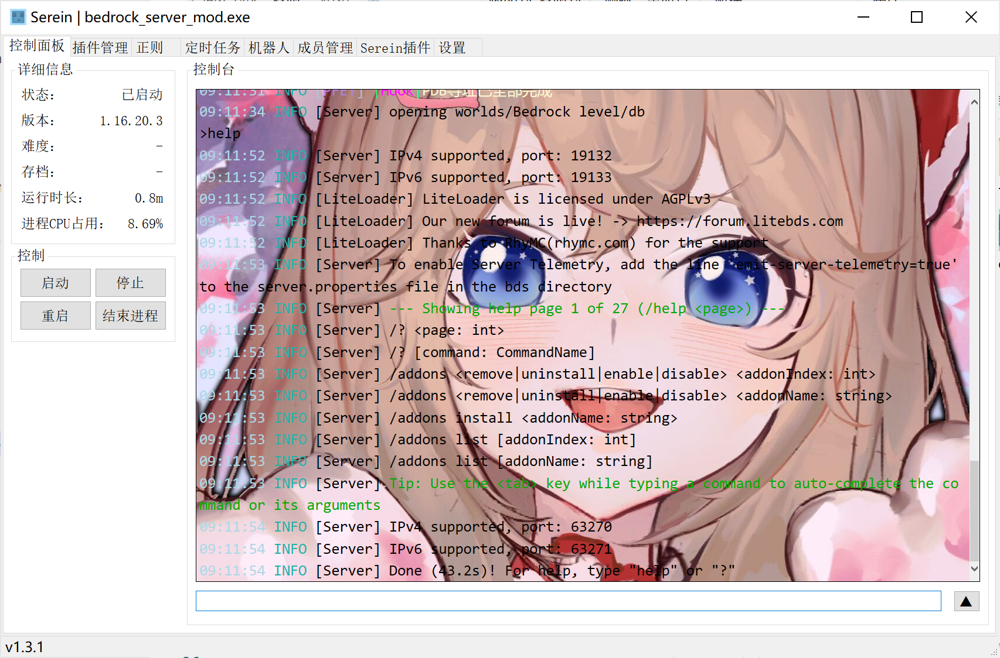

# 自定义控制台

自定义控制台的背景、字体

:::caution
仅 WinForm 和 v1.3.3 及以前的 WPF
:::

## 具体步骤

1. 打开`./console`文件夹
2. 在 Visual Studio Code 或者其他编辑器中编辑其中的文件
3. 重启 Serein 后生效

## 提示

- console.html 中定义的函数**不建议更改**，修改错误可能导致无法输出信息
- 由于显示网页组件默认以 IE 为内核，修改时内嵌网页时需注意**适配 IE 浏览器**

## 示例

```css
body {
    background-image: url('https://ts1.cn.mm.bing.net/th/id/R-C.775d33d222ea64b8a064542a67b93b2c?rik=Ue%2bT%2b5IB0mbmGw&riu=http%3a%2f%2fi1.hdslb.com%2fbfs%2farchive%2fb507af1d27b82cc5ffab2b58ad1eb8aff1509b22.jpg&ehk=nvlf29MJ3PJZwOxMO0ugrFHPaXH2mhUkyywPP1u7rhM%3d&risl=&pid=ImgRaw&r=0');
    background-size: cover;
}
```

:::info
这是一些示例图片  


:::
