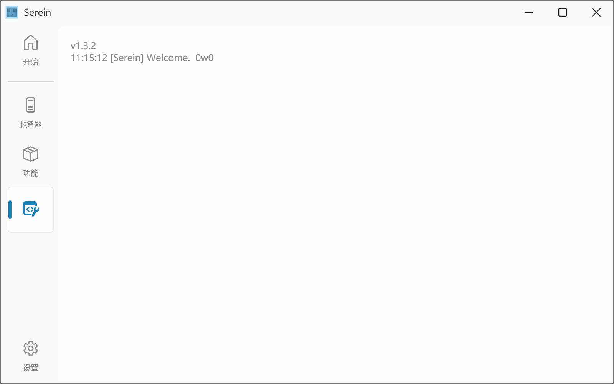

# 开启调试模式

开启 Serein 自带的调试输出窗口

:::note

- 供开发和调试使用，一般不建议开启
- 必要时可能会要求你开启此功能为开发者提供更多详细信息
:::



## 用途

供开发者确定函数的执行情况、变量的变化等，并总是自动保存日志到`logs/debug`文件夹下

### JS 插件

详见[debug 输出](../development/functions/serein#debug输出)

## 开启方法

### 命令行参数

使用 cmd 或 PowerShell 启动 Serein-???.exe ，在路径后面写上`debug`即可

```powershell
Serein-???.exe debug
```

### 更改设置

打开`settings/Serein.json`，将`developmentTool.enableDebug`后面的`false`改为`true`即可

```json
{
    // ...
    "developmentTool": {
        // 开启调试模式
        // highlight-next-line
        "enableDebug": true,

        // 详细的调试输出（包含函数参数类型和返回值，仅当上一项启用时生效）
        // highlight-next-line
        "detailDebug": false, 
        
        "note": "以上设置内容为开发专用选项，请在指导下修改"
    }
    // ...
}
```
